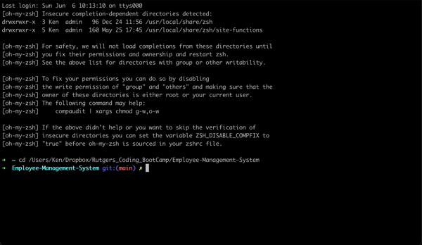

# Employee-Management-System
## Table of Contents
  * [Top Language](#top-language)
  * [Description](#description)
  * [Demo](#demo)
  * [Program Installation](#program-installation)
  * [Program Usage](#program-usage)
  * [Technologies](#technologies)
  * [Links](#links)
  * [License](#license)

## Top Language


## Description
The purpose of this application is to allow users to manage an employee database.\
Upon first loading the program, the end-user is prompted to choose between options.\
Users are allowed to add, remove or view employees, departments or employee titles.\
Upon refreshing, the data that was recently created will be there, and can be deleted or viewed.

## Demo

 
## Program Installation
To use this program we will need to install Node.js & MySQL Workbench.\
Please use the link below to download a suitable version for your OS:

[Node.js Downloads](https://nodejs.org/en/download/)

[MySQL Workbench Downloads](https://dev.mysql.com/downloads/workbench/)

Once installed we can load the pre-defined Schema & Seeds to populate the database.\
These two files are located in the links below:

[Schema](db/schema.sql)

[Seeds](db/seeds.sql)

Once loaded in the database use your command-line interface\
(Git/Terminal - MacOS, Linux & Ubuntu, CMD/Git - Windows)\
to run browse to the main repository, then run the following command:

```bash
npm install
```

The package.json will install the necessary dependencies for the program to run.

## Program Usage
After using the program installation instructions, we can then start using the program\
Remaining in the terminal, we can use the following command to run the application:

```bash
npm run start
```

The program will then initialize and function as shown in the demo.
## Technologies
- Javascript
- MySql
- Node.js

## Links
[Github Repository URL](https://github.com/KPetiote/Employee-Management-System)

## License

[](https://opensource.org/licenses/MIT)
